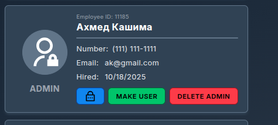

# Quality Electric Service - Руководство пользователя

## Содержание
*   [Введение](#introduction)
    *   [1.1 Общие сведения](#11-background)
    *   [1.2 О вашей системе](#12-about-your-system)
*   [Основы: Доступ пользователя и администратора](#basics-user-and-administrator-access)
    *   [2.2 Доступ к системе](#22-accessing-your-system)
*   [Учетные записи администратора](#administrator-accounts)
    *   [3.1 Что я могу делать как администратор?](#31-what-can-i-do-as-an-admin)
    *   [3.2 Команда](#32-team)
    *   [3.3 Клиенты](#33-clients)
    *   [3.4 Расписание](#34-schedule)
    *   [3.5 Восстановление пароля: Роль администратора](#35-password-recovery-administrator-role)
*   [Учетные записи пользователя](#user-accounts)
    *   [4.1 Что я могу делать как пользователь?](#41-what-can-i-do-as-a-user)
    *   [4.2 Расписание](#42-schedule)
    *   [4.3 Клиенты (для пользователя)](#43-clients-user)
*   [Смена/восстановление забытого пароля](#forgottenchanging-password)

---

## Введение

### 1.1 Общие сведения
Это руководство специально разработано для сотрудников Quality Electric Service. Оно поможет вам поддерживать, организовывать и вести подробные записи. В этом руководстве вы найдете скриншоты, объяснения и инструкции по правильному использованию системы.

Возможно, вам понадобится использовать это руководство несколько раз, прежде чем вы полностью разберетесь в системе. Как только вы привыкнете к ней, вам, возможно, больше не понадобится это руководство, но оно всегда будет здесь для справки.

### 1.2 О вашей системе
Эта система является программным обеспечением только для внутреннего использования, что означает, что у клиентов нет доступа к ней. На данный момент текущая версия не имеет функции входа для клиентов или создания учетных записей.

Исходный код через некоторое время будет размещен на Github.

## Основы: Доступ пользователя и администратора

### 2.2 Доступ к системе
Вы можете получить доступ к системе через любой браузер. Администратор системы определяет, имеете ли вы доступ к административной версии системы. Между учетными записями пользователя и администратора не так много различий. Администраторы могут редактировать, добавлять и удалять расписания, а также создавать новых членов команды. Пользователи этого делать не могут.

Войдите в систему, заполнив поля `Email` и `Пароль`, и вы попадете на главную страницу системы Quality Electric Services.

Ввод неверного адреса электронной почты приведет к следующему сообщению об ошибке:

Ввод неверного пароля приведет к следующему сообщению об ошибке:

Если вы забыли пароль, пожалуйста, свяжитесь с администратором системы для его сброса.

---

## Учетные записи администратора

### 3.1 Что я могу делать как администратор?
Как администратор, после входа в систему вы попадаете на эту главную страницу.

Как администратор, вы можете получить доступ к следующим разделам:
1.  **Команда** – Добавление, редактирование и удаление членов команды.
2.  **Клиенты** – Добавление, редактирование и удаление клиентов и заказов.
3.  **Расписание** – Добавление новых заказов для выполнения и назначение ответственных.
4.  **Выход** – Возврат на страницу входа.

Для получения более подробной информации о том, что вы можете делать в каждом разделе, пожалуйста, прочитайте ниже.

### 3.2 Команда
При переходе в раздел "Команда" с главной страницы или через панель навигации, вы открываете список всех сотрудников, которые были внесены в систему. Здесь вы можете видеть информацию об учетных записях, включая ID сотрудника, номер телефона, Email и дату найма. Как администратор, вы можете "Сделать администратором" или "Удалить пользователя" для каждого члена команды. Вы также можете создать "Нового сотрудника" в верхней части страницы.

После выбора "Новый сотрудник" откроется меню, в котором вы можете заполнить информацию о новом сотруднике. Если вы нажали на это случайно, вверху есть кнопка отмены. Меню для заполнения включает имя и фамилию, номер телефона, Email и временный пароль, который нужно будет изменить.

> **ПРИМЕЧАНИЕ:** Вы можете сделать учетную запись пользователя учетной записью администратора после ее создания, найдя его профиль в списке членов команды и повысив его.

После добавления сотрудника он будет помещен в список сотрудников ниже. Чтобы вернуться на главную страницу, используйте панель навигации в верхней части страницы. Если вы хотите перейти в другой раздел системы, вы также можете сделать это отсюда.

### 3.3 Клиенты
При выборе раздела "Клиенты" вы попадаете в меню создания и поиска клиентов. Вы можете создавать профили клиентов в верхнем меню. Для создания нового профиля клиента необходимо заполнить всю информацию. Ниже показано, как выглядит это меню. После правильного заполнения информации нажатие кнопки "Создать профиль клиента" добавит новый профиль в базу данных.

В строке поиска вы можете искать клиентов по имени. Когда вы найдете нужного клиента, вы можете нажать на стрелку выпадающего списка, чтобы развернуть информацию о клиенте. После выбора стрелки вы увидите номер телефона, Email, адрес, штат и почтовый индекс. Из этого меню вы также можете "Просмотреть заказы" этого клиента и "Удалить клиента", чтобы удалить его из системы.

> **ВНИМАНИЕ:** Если вы удалите клиента, вы потеряете все заказы, связанные с ним. Поэтому для удаления клиента появится всплывающее окно с подтверждением, в котором вас спросят, уверены ли вы, что хотите удалить клиента.

Нажав "Просмотреть заказы", вы перейдете на страницу в профиле клиента. Отсюда вы можете выполнять те же действия, что и на предыдущем экране, а также создавать заказы и просматривать историю заказов.

При создании заказа важно записать любую важную информацию, которую технический специалист должен знать перед прибытием на место. В процессе создания заказа вы должны заполнить дату и время, тип генератора и тип услуги из выпадающих меню, которые запрашивает клиент.

Также внизу формы есть раздел для дополнительных примечаний. Здесь вы можете указать любые дополнительные запросы от клиента, а также проблемы, предупреждения или возможные трудности.

### 3.4 Расписание
Переход на вкладку расписания откроет меню, где вы можете искать заказы по дате или множеству других опций. Из этого меню вы можете найти расписание заказов на определенную дату и назначить сотрудников для их выполнения. Заказы также можно удалять и помечать как выполненные с этого экрана, используя значки корзины и галочки соответственно.

Из строки поиска вы попадете в календарь, где можно выбрать дату. После выбора даты отобразятся все заказы на этот день. Вы можете назначить до четырех членов команды на один заказ.

После того как вы назначите технического специалиста на заказ, он сможет просматривать свое расписание и видеть, на какие заказы он назначен.

После назначения технического специалиста на заказ появится следующее уведомление.

Если технический специалист уже добавлен к заказу, произойдет следующая ошибка.

Если технический специалист случайно пометит заказ как выполненный, с вами могут связаться, чтобы установить статус заказа как "невыполненный". Если такая ситуация возникнет, маленький кружок с "x" установит статус заказа как "невыполненный". Как только заказ будет помечен как невыполненный, вверху появится уведомление, подтверждающее это.

Заказы также можно редактировать с помощью кнопки с изображением буфера обмена, расположенной слева от корзины. В этом меню вы можете изменить любую информацию о заказе, которая была запланирована ранее. Например, если клиенту нужно изменить дату услуги или тип услуги. Именно здесь вы должны вносить изменения, вместо того чтобы создавать совершенно новый заказ и удалять старый с неверной информацией.

### 3.5 Восстановление пароля: Роль администратора
Чтобы восстановить свой пароль, сотрудник должен связаться с администратором. Ваша задача как администратора — найти этого человека на странице "Команда" и получить для него код восстановления, который он сможет использовать для сброса пароля. Для этого нажмите синюю кнопку с замком.

После нажатия этой кнопки в верхней части экрана появится уведомление с кодом восстановления. Вы должны передать этот код сотруднику, которому нужно сбросить пароль. Код будет случайным.

После того как вы передадите код сотруднику, которому нужно сбросить пароль, ваша работа в этом вопросе завершена.

---

## Учетные записи пользователя

### 4.1 Что я могу делать как пользователь?
Как пользователь, после входа в систему вы попадаете на эту главную страницу.

Как пользователь, вы можете получить доступ к следующим разделам:
1.  **Клиенты** – Добавление, редактирование и удаление клиентов и заказов.
2.  **Расписание** – Просмотр назначенных заказов и их отметка как выполненных.
3.  **Выход** – Возврат на страницу входа.

Для получения более подробной информации о том, что вы можете делать в каждом разделе, пожалуйста, прочитайте ниже.

### 4.2 Расписание
Как пользователь, вы можете видеть только свое собственное расписание. Здесь указано, какие заказы вы должны выполнять и в какие дни. Вы можете искать заказы на основе недели, месяца, дня и т.д. В ваших заказах будет описание работы, будь то ремонт, установка и т.д. Вы также можете видеть любые дополнительные заметки, оставленные вашими администраторами.

Когда вы закончите работу, вы нажмете на галочку рядом с датой, и система автоматически запишет время и дату выполнения заказа. При завершении заказа ваши администраторы будут уведомлены об этом в разделе расписания с их стороны.

После того как вы нажмете на галочку, в верхней части экрана появится уведомление о том, что запись была создана, и галочка изменится на автоматически собранные дату и время.

> **ПРИМЕЧАНИЕ:** Если вы пометили заказ как выполненный, вы не сможете отменить это действие самостоятельно. Чтобы отменить выполнение заказа, вам необходимо связаться с администратором системы.

Если вы были назначены на заказ на определенный день, но он не отображается при выборе этого дня, пожалуйста, перепроверьте выбранную дату, а также имя клиента. Возможно, дата была изменена. Если вы все еще не можете найти заказ, свяжитесь с администратором системы.

### 4.3 Клиенты (для пользователя)
При выборе раздела "Клиенты" вы попадаете в меню создания и поиска клиентов. Вы можете создавать профили клиентов в верхнем меню. Для создания нового профиля клиента необходимо заполнить всю информацию.

После правильного заполнения информации нажатие кнопки "Создать профиль клиента" добавит новый профиль в базу данных.

В строке поиска вы можете искать клиентов по имени. Когда вы найдете нужного клиента, вы можете нажать на стрелку выпадающего списка, чтобы развернуть информацию о клиенте. После выбора стрелки вы увидите номер телефона, Email, адрес, штат и почтовый индекс. Из этого меню вы также можете "Просмотреть заказы" этого клиента. **Учетные записи пользователей не могут удалять клиентов.**

Нажав "Просмотреть заказы", вы перейдете на страницу в профиле клиента. Отсюда вы можете выполнять те же действия, что и на предыдущем экране, а также создавать заказы и просматривать историю заказов.

При создании заказа важно записать любую важную информацию, которую технический специалист должен знать перед прибытием на место. В процессе создания заказа вы должны заполнить дату и время, тип генератора и тип услуги из выпадающих меню, которые запрашивает клиент. Также внизу формы есть раздел для дополнительных примечаний. Здесь вы можете указать любые дополнительные запросы от клиента, а также проблемы, предупреждения или возможные трудности.

> **ПРИМЕЧАНИЕ:** Если в профиле клиента есть что-то неверное, что необходимо обновить (например, изменился адрес или тип используемого генератора не обновлен в системе), обязательно свяжитесь с администратором системы, чтобы исправить эти несоответствия и избежать проблем в будущем.

---

## Смена/восстановление забытого пароля
Чтобы сменить пароль, любой сотрудник должен запросить код восстановления у администратора. Чтобы продолжить смену пароля, возьмите код восстановления, полученный от администратора, и перейдите по ссылке "Забыли пароль" под меню входа. Там вы введете свой email, полученный код и новый пароль, который вы хотели бы использовать.

После успешной смены пароля появится уведомление, подтверждающее, что вы действительно сменили пароль.

После получения этого уведомления вы успешно сменили пароль и можете войти в свою учетную запись.

