# Quality Electric Service - User Instruction Manual

---

## Table of Contents
*   [Introduction](#introduction)
    *   [1.1 Background](#11-background)
    *   [1.2 About Your System](#12-about-your-system)
*   [Basics: User and Administrator Access](#basics-user-and-administrator-access)
    *   [2.2 Accessing Your System](#22-accessing-your-system)
*   [Administrator Accounts](#administrator-accounts)
    *   [3.1 What Can I Do As An Admin?](#31-what-can-i-do-as-an-admin)
    *   [3.2 Team](#32-team)
    *   [3.3 Clients](#33-clients)
    *   [3.4 Schedule](#34-schedule)
    *   [3.5 Password Recovery: Administrator Role](#35-password-recovery-administrator-role)
*   [User Accounts](#user-accounts)
    *   [4.1 What Can I Do As A User?](#41-what-can-i-do-as-a-user)
    *   [4.2 Schedule](#42-schedule)
    *   [4.3 Clients](#43-clients-user)
*   [Forgotten/Changing Password](#forgottenchanging-password)

---

## Introduction

### 1.1 Background
This manual is specifically designed for the use of Quality Electric Service employees. It will help you maintain, organize, and keep detailed records. In this manual you'll find screenshots, explanations, and instructions on how to properly use the system.

You may need to use this manual a couple of times before fully understanding the system. Once you get used to it you might not need to use this guide anymore, but it will be here for you to reference.

### 1.2 About Your System
This system is internal-only software, meaning customers do not have access to use it. As of right now, the current version has no customer login or account creation.

The source code will be on Github soon after some time.

## Basics: User and Administrator Access

### 2.2 Accessing Your System
You can access your system through any browser. Your system Administrator determines whether you have access to the admin version of the system. There aren't many differences between the User and Admin accounts. Administrators can edit, add, and delete schedules, and create new Team Members. Users are unable to do so.

Login by filling out the `Email` and `Password` fields, this will take you to the main home page of the Quality Electric Services system.

Entering an invalid email will provide an error message as follows:

Entering an invalid password will provide this error message:

If you forget your password, please contact your system Administrator in order to reset your password.

---

## Administrator Accounts

### 3.1 What Can I Do As An Admin?
As an Admin, after you log in, you are met with this home page.

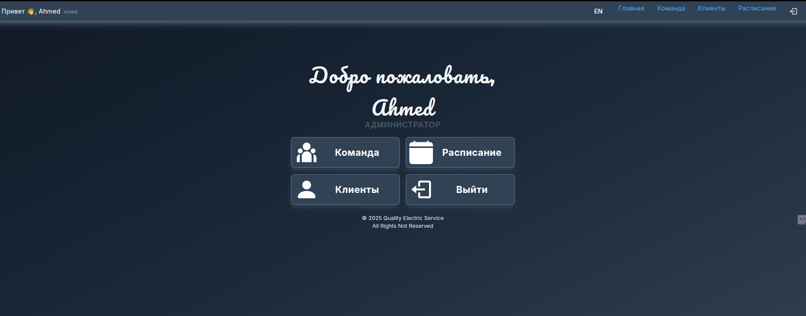

You are able to access the following sections as an Admin.
1.  **Team** – Add, Edit, and Delete Team Members
2.  **Clients** – Add, Edit, and Delete Clients and Jobs
3.  **Schedule** - Add new Jobs for completion and who is tasked with them.
4.  **Logout** - Take you back to the Login Page

For greater detail of what you can do in each section please read below.

### 3.2 Team
When accessing the Team Section of the Home Page or Navigation Bar, you open a list of all the employees that have been entered into the system. From here you're able to see the information of the accounts, this includes EmployeeID, PhoneNumber, Email, and DateHired. As an Admin you're able to "Make Admin" or "Delete User" for each team member. You're also able create "New Employee” at the top of the page.

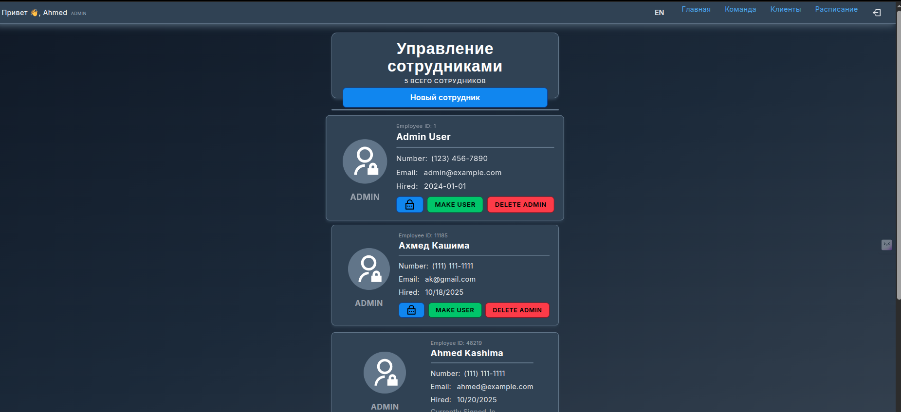

After selecting “New Employee” a menu will open so that you may fill out the information of the new employee. If you click this accidentally, there is a cancel button at the top. The fill-in menu includes First and Last Name, Phone Number, Email, and a filler Password to be changed later.

> **NOTE:** You are able to make a User account an Administrator account after completion by finding their profile in the list of team members and promoting them.

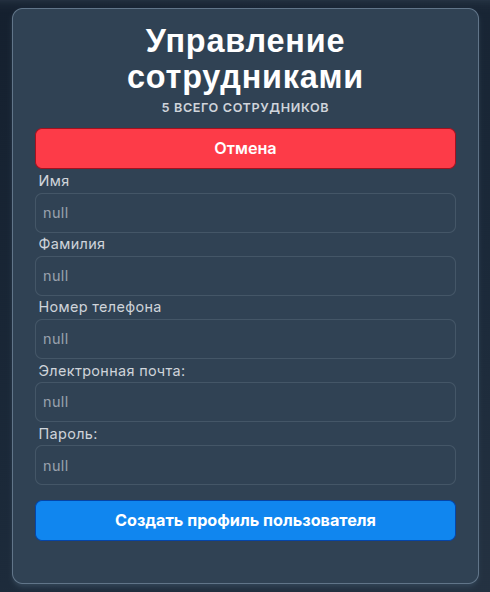

After an employee is added, they will be put into the list of employees below. To return to the Home Page use the navigation bar at the top of the page. If you'd like to move to a different section of the system, you can do that from here as well.

### 3.3 Clients
When selecting the Clients section of the system, you are brought to a client creation and search menu. You can create customer profiles in the top menu. You must fill in all the information to create a new customer profile. Below is what that menu looks like. Once the information is correctly filled out, clicking the "Create Client Profile" button will add the new profile to the database.

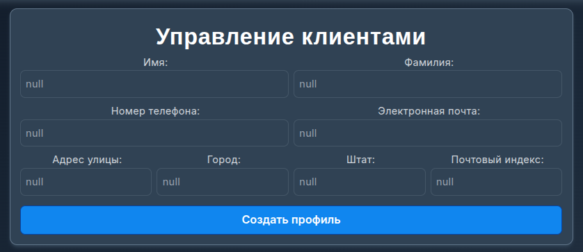

From the search bar, you may search for clients by name. When you find the customer you're looking for, there is a drop-down arrow to expand the information of the client. After selecting the drop-down arrow, the Phone Number, Email, Address, State, and Zip Code are there for you to view. From this menu, you may also "View Jobs" of that customer and “Delete Customer” to remove them from the system.

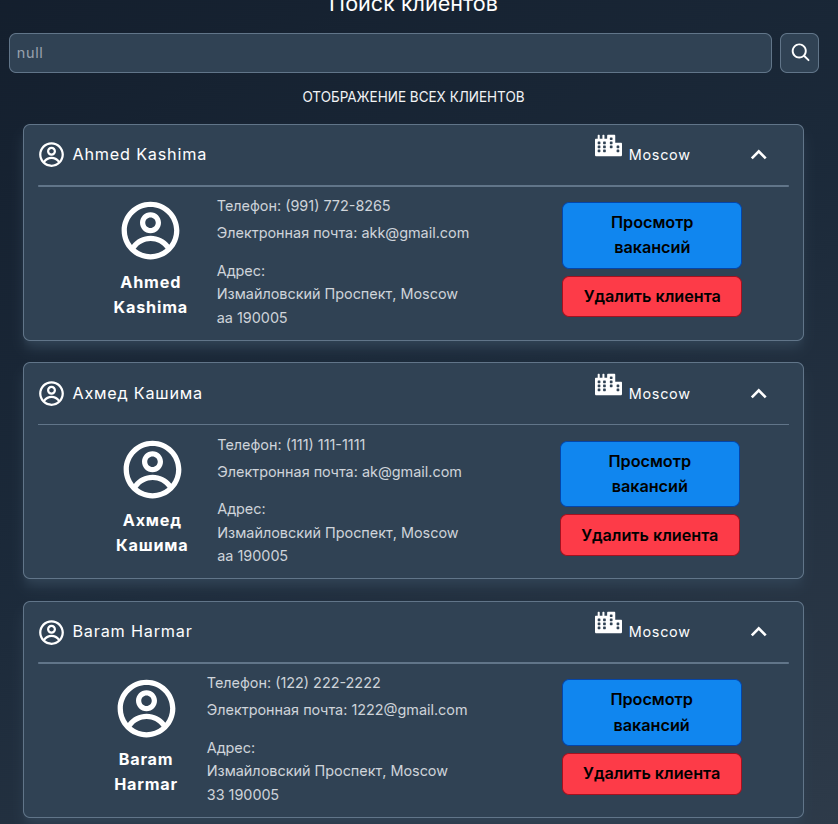

> **WARNING:** If you delete a customer, you will lose the jobs associated with said customer. Therefore, in order to delete a customer, a confirmation popup will ask if you are sure you want to delete the customer.

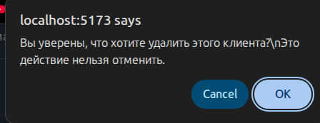

By selecting "View Jobs" it will take you to a page within the client's profile. From here you may do all the same things from the previous screen, as well as Create Jobs and see the Job History.

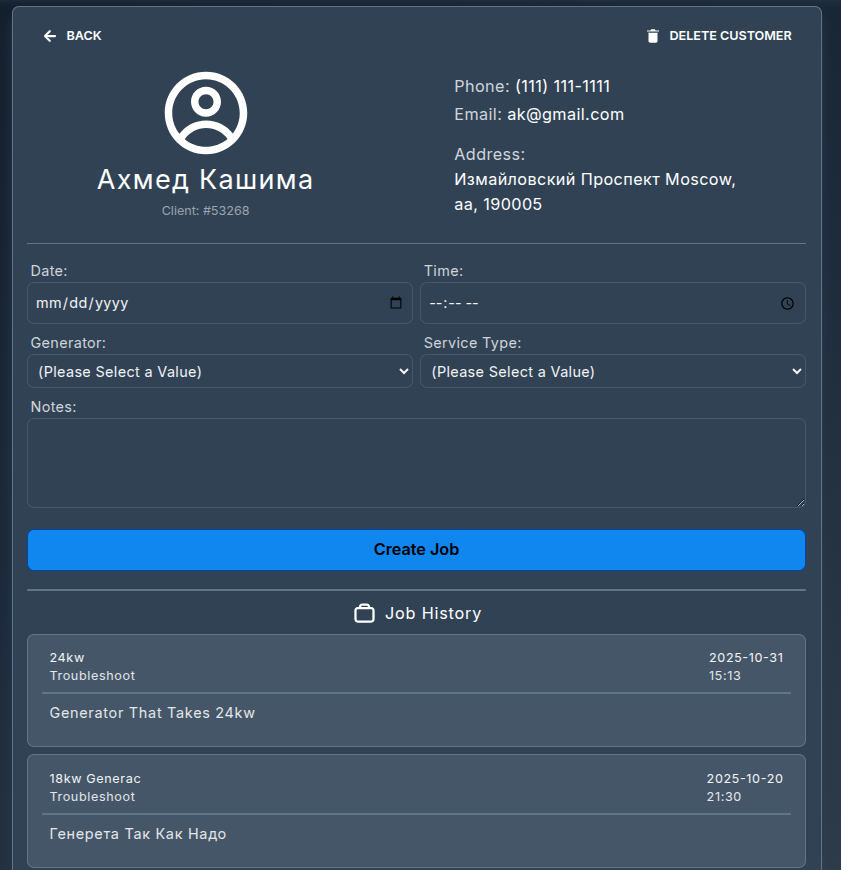

When Creating a Job, it is important to note down any important information that a technician may need to know before they get to the Job Location. In the job creation process, you must fill in the Date and Time, the type of Generator, and the type of Service from the drop-down menus that the Client is requesting.

There is also a section for additional notes at the bottom of the form. Here you may put any additional requests from the client, as well as issues, warnings, or possible problems.

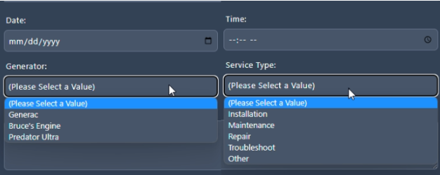

### 3.4 Schedule
Going to the schedule tab will bring up a menu where you are able to search for jobs based on the date or a variety of other options. From this menu, you are able to find the jobs scheduled for a specific date and assign employees to work on them. Jobs can also be deleted and completed from this screen using the trashcan and check mark respectively.

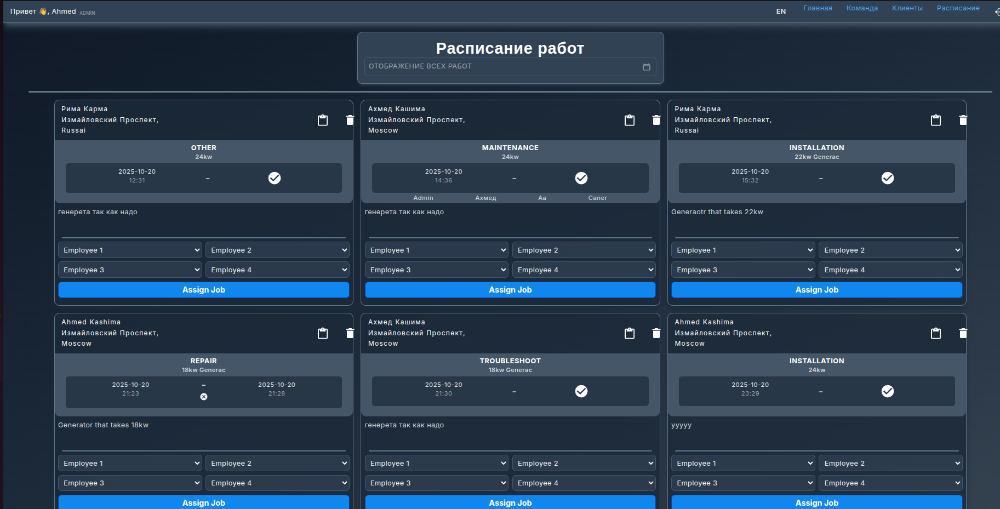

From the search bar, it will take you to this calendar where you may choose a date. After choosing a date, all the jobs from that day will show. You are able to assign up to four team members to a job.

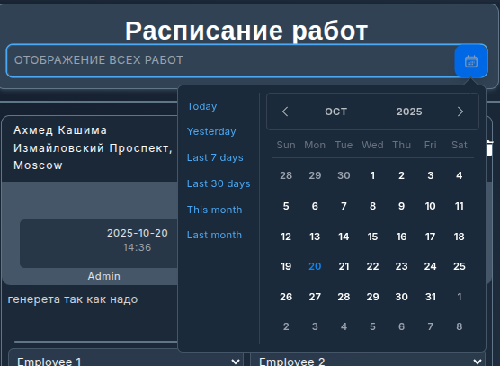

After you schedule a technician for a job, that technician will be able to view their schedule and see what jobs they are scheduled for.

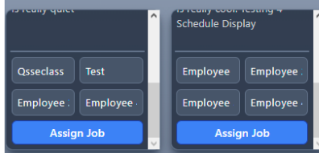

After you schedule a technician for a job the following alert will occur.

If a technician is already added to a job an error will occur as follows.

If a technician accidentally completes a job, you may be contacted in order to set the job as incomplete. If that situation arises, the small circle with an "x" will set the job as incomplete. As a job is set as incomplete, an alert will show at the top confirming that the job was set as incomplete.

Jobs are also able to be edited with the clipboard button located on the left of the trashcan. In this menu, you are able to change anything about the job that was previously scheduled. For example, say a client needs to change the date of their service or they need to change the type of service. This is where you would change that instead of creating a completely new job and deleting the old one with the wrong information.

### 3.5 Password Recovery: Administrator Role
In order for an individual to recover their password, they must contact an Administrator. As an Administrator, your job is to find that person on the Team page and retrieve a recovery code for them to use in resetting their password. To do this, click the BLUE lock button.

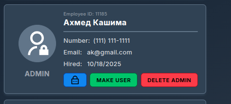

After you press this button, a notification at the top of the screen will come up with a recovery code. You must give it to the individual who needs to reset their password. The code will be random.

After you pass the code along to the individual who needs to reset their password, your job in the matter is complete.

---

## User Accounts

### 4.1 What Can I Do As A User?
As a User, after you log in, you are met with this home page.

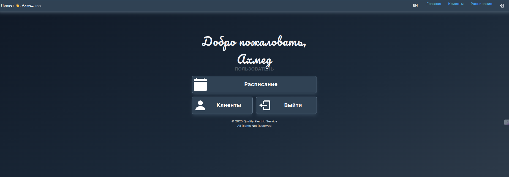

You are able to access the following sections as a User.
1.  **Clients** – Add, Edit, and Delete Clients and Jobs
2.  **Schedule** - View assigned jobs and mark them as complete.
3.  **Logout** - Take you back to the Login Page

For greater detail of what you can do in each section please read below.

### 4.2 Schedule
As a User, you are only able to see your own schedule. This is what jobs you have to do on what days. You can search what jobs you have based on the week, month, day, and more. Your jobs will give you a description of the job, whether it be repair, installation, etc. You can also see any additional notes left by your administrators.

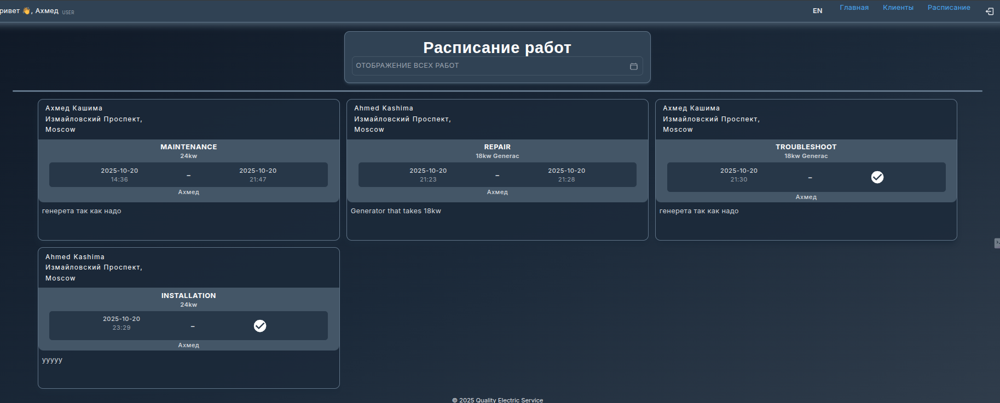

When you have finished a job, you will select the check mark next to the date and it will automatically record the time and date you completed the job. When completing a job, your administrators will be notified through the scheduling section on their end.

After you select the check mark a notification at the top of the screen will appear, stating that the record was created and the check mark will be changed to the automatically gathered date and time.

> **NOTE:** If you set a job to complete, you are unable to uncomplete said job afterwards. In order to uncomplete said job you must contact your system administrator to undo the change.

If you were scheduled for a job on a specific day and it isn't coming up when you select the day, please double-check the date you selected, as well as the client's name. It is possible the date was changed. If you still can't find the job you're looking for, contact your system administrator.

### 4.3 Clients (User)
When selecting the Clients section of the system, you are brought to a client creation and search menu. You can create customer profiles in the top menu. You must fill in all the information to create a new customer profile.

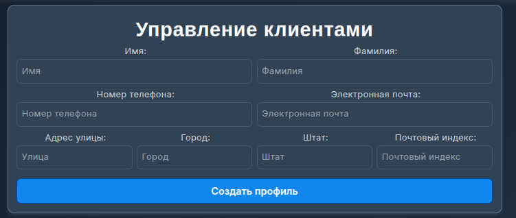

Once the information is correctly filled out, clicking the “Create Client Profile" button will add the new profile to the database.

From the search bar, you may search for clients by name. When you find the customer you're looking for, there is a drop-down arrow to expand the information of the client. After selecting the drop-down arrow, the Phone Number, Email, Address, State, and Zip Code are there for you to view. From this menu, you may also "View Jobs" of that customer. **User accounts are unable to delete clients.**

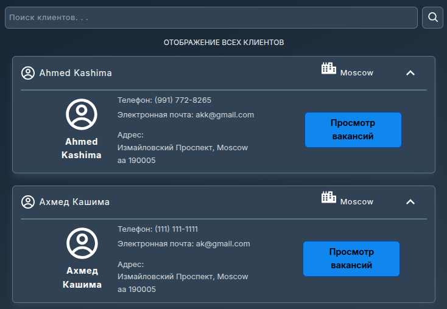

Selecting "View Jobs" it will take you to a page within the client's profile. From here you may do all the same things from the previous screen, as well as Create Jobs and see the Job History.

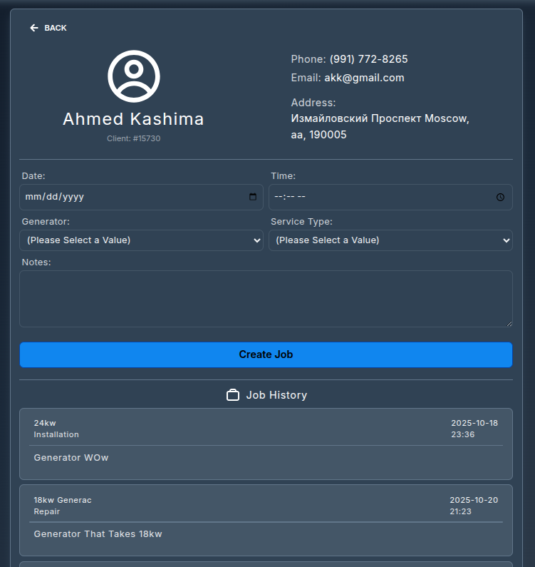

When Creating a Job, it is important to note down any important information that a technician may need to know before they get to the Job Location. In the job creation process, you must fill in the Date and Time, the type of Generator, and the type of Service from the drop-down menus that the Client is requesting. There is also a section for additional notes at the bottom of the form. Here you may put any additional requests from the client, as well as issues, warnings, or possible problems.

> **NOTE:** If there is something wrong with a client's profile that must be updated (for example, their address has changed, or the type of generator they use has been changed and not updated in the system), make sure to contact your systems Administrator in order to fix these discrepancies so there are no issues in the future.

---

## Forgotten/Changing Password
In order for anyone to change their password, they must request a recovery code from an Administrator. To proceed in changing your password, take the recovery code you received from an Administrator and navigate to the "Forgot Password" link under the login menu. From there you will insert your email, the code you received, and the new password you would like to use.

Once you have successfully changed your password a notification will appear confirming that you have in fact changed your password.

After you receive this notification, you have successfully changed your password and can log in to your account.
